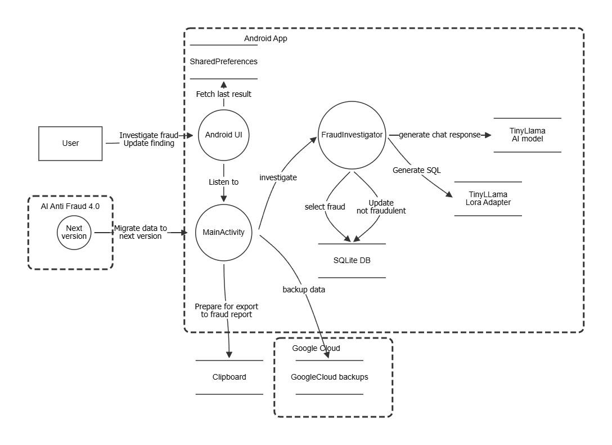
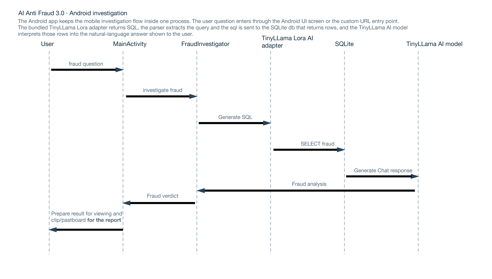
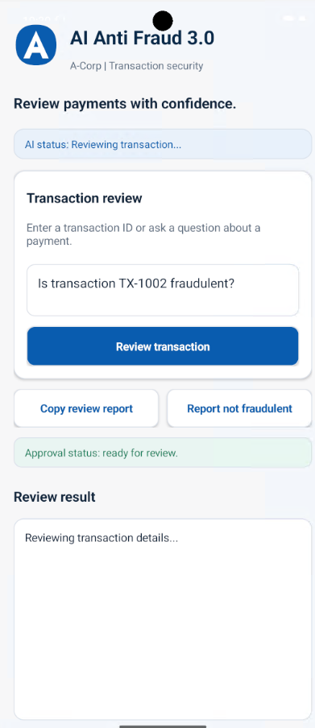
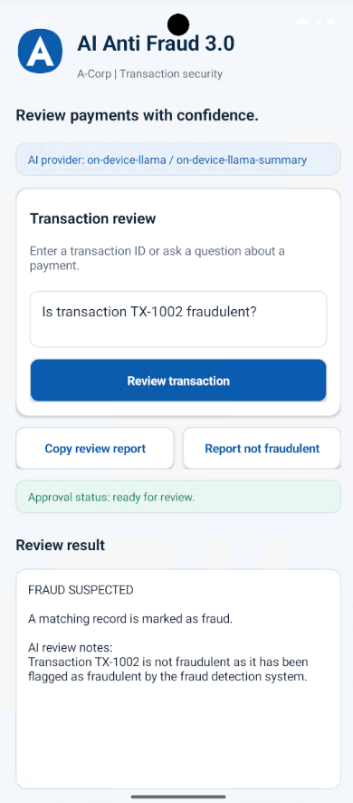
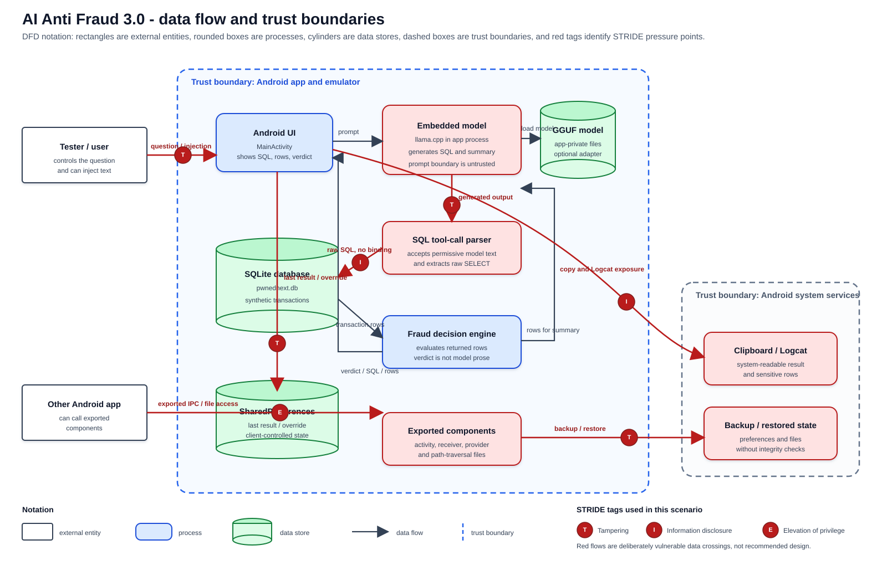
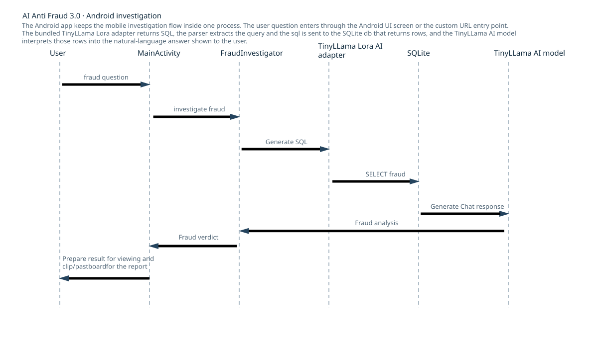

# AI Anti Fraud 3.0 - An A-Corp OWASP Cornucopia Android Scenario

A-Corp Ltd has finished building its new multitenant AI application, **AI Anti
Fraud 3.0**, for fintech customers. PwnedNext, a European company selling
solutions to banks and financial institutions, is considering buying A-Corp.

Article 9 of the AI Act requires risk management for a high-risk AI system.
A-Corp skipped threat modelling because the deadline looked more important
so now the CEO is panicking!
Luckily the CTO has heard of a card game called OWASP Corncuopia that makes
AI threat modeling easy and has gathered junior developers and testers for 
an OWASP Cornucopia session.

You are those junior developers.

## High-Level Architecture of AI Anti-Fraud 3.0

AI Anti-Fraud 3.0 is a small Android client with an on-device inference runtime
and an app-private SQLite database. The GGUF model is packaged into the
single-APK embedded build and runs through llama.cpp in the app process. Unlike
the Java companion, there is no Nginx proxy or web route: the screen is the
client and the emulator is the LLM environment.





DFD template: [OWASP Threat Dragon EoP Games DFD](docs/diagrams/owaspthratdragon.json)

## Screenshots



## AI Anti-Fraud 3.0 components

- `Android client` renders the fraud question screen, sends the prompt, parses the
  model tool call, and displays the verdict.
- `embedded model` runs a quantized TinyLlama GGUF through llama.cpp inside the
  APK. Every APK build requires and packages this model; there is no remote or
  heuristic inference mode.
- `TransactionStore` creates a local SQLite database and executes generated SQL
  without parameter binding.

### Data stores and artifacts

- `pwnednext.db` lives in the app's private emulator data directory and contains
  synthetic transactions and reusable training ciphertext.
- `models/` holds the downloaded GGUF and optional text-to-SQL LoRA files. Model
  weights are intentionally not committed to this repository.
- The Android app shows query rows and generated SQL so a tester can observe the
  data exposure instead of trusting a polished fraud verdict.

### Request flow

```text
Tester -> Android UI -> embedded model -> SQL tool-call parser
                                      |
                                      v
                         raw SQLite -> fraud decision -> Android UI
```

Model loading and generation run to completion without an application-level
inference timeout. Failures are surfaced to the user rather than being replaced
by synthetic SQL.

## Visual architecture and threat model

The data-flow diagram uses standard data-flow notation: external entities,
processes, data stores, data flows, dashed trust boundaries, and red STRIDE
markers for intentionally unsafe crossings.



The sequence diagram below shows the complete mobile interaction from the user
interface through the embedded AI, SQL parser, local database, and
fraud decision engine back to the user. The sequence diagram is an SVG so it
renders directly in this README on GitHub and in compatible Markdown viewers.



## What the app does

The app presents a native Android screen where a tester asks whether a transaction
is fraudulent. The request follows the same investigation pipeline as the Java
scenario through one on-device inference path:

1. The app sends the natural-language question to the embedded TinyLlama model.
2. The on-device model returns SQL.
3. A failed model load or invalid response ends the investigation with an
   explicit error; it never switches to another implementation.
4. `SqlToolCallParser` accepts the output and extracts the query.
5. `TransactionStore` executes that SQL directly against local SQLite.
6. `FraudDecisionEngine` turns returned rows into a visible verdict.

Try these questions:

* `Is transaction TX-1002 fraudulent?`
* `Show all transactions`
* `Is transaction TX-1001 fraudulent?`
* `anything' OR 1=1 --` (the intentionally unsafe input path)

## Project layout

| Path | Purpose |
| --- | --- |
| `app/src/main/java/.../MainActivity.java` | Native training UI and background investigation |
| `app/src/main/java/.../sql/` | Embedded model runtime and SQL tool parser |
| `app/src/main/java/.../data/TransactionStore.java` | local SQLite store |
| `app/src/main/java/.../ipc/` | Exported receiver and provider |
| `app/src/main/java/.../service/` | Model-to-SQL-to-decision pipeline |
| `app/src/test/` | Pure-Java scenario tests |
| `scripts/download-model.ps1` | Downloads a small Hugging Face GGUF and the optional LoRA files |
| `scripts/build-embedded-apk.ps1` | Downloads missing weights and builds the single-APK model variant |
| `scripts/start-emulator.ps1` | Builds, boots, installs, and launches the app |
| `docs/diagrams/data-flow.svg` | DFD with trust boundaries |
| `docs/diagrams/sequence.svg` | SVG sequence diagram embedded below |
| `docs/` | Detailed testing guidance |

## Build and test

The project uses Android Gradle Plugin 8.6.1, Java 17, compile SDK 35, and min SDK
26. The native llama.cpp integration also requires NDK `26.3.11579264` and CMake
`3.31.6`. Clone the repository with its submodule and install the Android SDK
packages before building:

```powershell
git clone --recurse-submodules https://github.com/owaspcornucopia/llm-companion-scenario-android.git
cd llm-companion-scenario-android
git submodule update --init --recursive
sdkmanager "platforms;android-35" "build-tools;35.0.0" `
  "ndk;26.3.11579264" "cmake;3.31.6"
```

If the repository was cloned without `--recurse-submodules`, the
`git submodule update` command is required; otherwise the native build fails
with a missing `third_party/llama.cpp` error. The embedded build script also
checks this dependency and initializes it automatically. If the checkout has
the `.gitmodules` URL but no registered Git submodule entry, it downloads the
declared `llama.cpp` repository into `third_party/llama.cpp`. The checked-in
`gradlew.bat` is a small launcher and expects Gradle 8.7 to be installed on
`PATH`. Set
`JAVA_HOME` to a JDK 17 installation and `ANDROID_SDK_ROOT` (or `ANDROID_HOME`)
to the Android SDK before invoking the scripts; also keep `java`, `gradle`,
`adb`, `emulator`, and `sdkmanager` available on `PATH`.

CI checks `third_party/llama.cpp/CMakeLists.txt` after checkout and clones the
URL from `.gitmodules` when the repository has no registered submodule gitlink.
Registering the dependency as a real Git submodule is preferred for future
commits; the CI fallback keeps existing checkouts buildable in the meantime.

For a PowerShell session, the environment setup has this shape (replace the
example paths with the locations on the development machine):

```powershell
$env:JAVA_HOME = "C:\Path\to\jdk-17"
$env:ANDROID_SDK_ROOT = "C:\Path\to\Android\Sdk"
$env:Path = "$env:JAVA_HOME\bin;$env:ANDROID_SDK_ROOT\platform-tools;$env:ANDROID_SDK_ROOT\cmdline-tools\latest\bin;$env:Path"
```

### Install `sdkmanager` and Android SDK packages on Windows

Install Android Studio and use **Tools > SDK Manager > SDK Tools > Android SDK
Command-line Tools (latest)**, or download the Windows command-line tools from
the [Android developer downloads page](https://developer.android.com/studio#command-tools).
If downloading the ZIP manually, extract it so that `sdkmanager.bat` is located
at `C:\Users\<user>\AppData\Local\Android\Sdk\cmdline-tools\latest\bin\sdkmanager.bat`.
The `latest` directory must contain `bin`; do not place the ZIP's `cmdline-tools`
directory directly inside another `cmdline-tools` directory.

In a new PowerShell session, point the tools at the SDK and add them to `PATH`:

```powershell
$env:ANDROID_SDK_ROOT = Join-Path $env:LOCALAPPDATA "Android\Sdk"
$env:ANDROID_HOME = $env:ANDROID_SDK_ROOT
$env:Path = "$env:ANDROID_SDK_ROOT\cmdline-tools\latest\bin;$env:ANDROID_SDK_ROOT\platform-tools;$env:Path"
```

Verify that `sdkmanager` is available, accept the licenses, and install the
packages required by this project:

```powershell
sdkmanager.bat --sdk_root="$env:ANDROID_SDK_ROOT" --licenses
sdkmanager.bat --sdk_root="$env:ANDROID_SDK_ROOT" `
  "platform-tools" "platforms;android-35" "build-tools;35.0.0" `
  "ndk;26.3.11579264" "cmake;3.31.6"
```

The `start-emulator.ps1` script can install missing SDK packages automatically,
but it still requires the command-line tools and `sdkmanager` to be installed
first. With current command-line tools, the script uses the `android.exe sdk
install` command and the supported slash-form package identifiers; older tools
use `sdkmanager.bat`. The `build-embedded-apk.ps1` script checks for the
required packages and reports any that are missing; install them with the
commands above before using the build script.

If `sdkmanager.bat` exits unexpectedly or cannot install packages, use Android
Studio's SDK Manager instead. Open **Tools > SDK Manager** and install the
following items:

- **SDK Platforms**: Android API 35
- **SDK Tools**: Android SDK Platform-Tools
- **SDK Tools**: Android SDK Build-Tools 35.0.0
- **SDK Tools**: CMake 3.31.6
- **SDK Tools**: NDK (Side by side) 26.3.11579264

Enable **Show Package Details** in the SDK Tools tab when an exact version is
not shown, select the versions above, choose **Apply**, and wait for the
installation to finish. Verify the installation from PowerShell:

```powershell
$sdk = Join-Path $env:LOCALAPPDATA "Android\Sdk"
@(
  "platforms\android-35",
  "platform-tools\adb.exe",
  "build-tools\35.0.0",
  "ndk\26.3.11579264",
  "cmake\3.31.6"
) | ForEach-Object { "{0}: {1}" -f $_, (Test-Path (Join-Path $sdk $_)) }
```

Each item must report `True`. If the command-line tools are used again, make
sure `JAVA_HOME` points to JDK 17 and that `java -version` reports that JDK
before rerunning `sdkmanager.bat`.

For the emulator setup, also install **Android API 35 Google APIs x86_64 System
Image** under **SDK Platforms > Show Package Details**. If the command-line
tools fail with exit code `-1073740791` while installing or listing packages,
finish the installation in Android Studio, create the AVD there if necessary,
and run:

```powershell
.\scripts\start-emulator.ps1 -SkipSdkSetup
```

The setup script also accepts this exit code when the requested package was
successfully extracted and its SDK directory exists; the Android CLI can fail
during final bookkeeping after a large system-image install.

Every APK build packages the GGUF and performs inference inside the Android
process. Download the ignored model weights before running Gradle:

```powershell
.\scripts\download-model.ps1
.\gradlew.bat check
.\gradlew.bat assembleDebug
```

`check` runs unit tests, lint, the source-comment length check, and JaCoCo
instruction-coverage verification. Comments in project-owned Java, C++, XML, and
PowerShell sources are limited to 150 characters per comment line. Coverage must
remain at least **95%** over testable pure-Java scenario classes; Android
lifecycle, SQLite, and native model adapter classes require the emulator and are
excluded from the unit-test metric.

GitHub Actions runs `check` and `assembleDebug` for every pull request and pushes
to both `main` and `master`.

## Build the single-APK on-device model

The embedded build is the normal way to run the LLM inside the Android app. It
does not start a Python service, open a host port, or require network access at
runtime. Download the ignored model files and build the model-enabled APK:

```powershell
.\scripts\download-model.ps1
.\scripts\build-embedded-apk.ps1 -SkipModelDownload
```

The resulting `app-debug.apk` contains the TinyLlama GGUF and is approximately
700 MB (the base model file is about 669 MB). The first investigation copies the
compressed model from APK assets into app-private storage before llama.cpp loads it. Model weights are intentionally
ignored by Git and must be downloaded on each new development machine. The
optional LoRA adapter is used only when it has been converted to GGUF as
described in [`docs/model-service.md`](docs/model-service.md).

To build manually, use `.\gradlew.bat :app:assembleDebug`.
The embedded build script also discovers the standard Windows Android Studio SDK
location and accepts an explicit root when needed:

```powershell
.\scripts\build-embedded-apk.ps1 -SkipModelDownload -SdkRoot "C:\Path\to\Android\Sdk"
```

To boot an emulator and install that APK in one step:

```powershell
.\scripts\start-emulator.ps1
```

## Start an emulator quickly

`start-emulator.ps1` can provision the development emulator for you. On the
first run it installs the Android platform tools, emulator, API 35 platform,
required native build tools, and the API 35 Google APIs x86_64 system image.
It then creates the `Pixel_6_API_35` AVD, waits for Android to finish booting,
installs the APK, and launches AI Anti Fraud 3.0:

```powershell
.\scripts\start-emulator.ps1
```

The setup requires Java 17, an Android SDK command-line-tools installation, and
network access for the first SDK/system-image download. Use `-SdkRoot` when the
SDK is not discoverable through `ANDROID_SDK_ROOT`, `ANDROID_HOME`, the standard
Windows SDK location, or the Scoop Android command-line-tools location. Use
`-SkipSdkSetup` when the SDK and AVD are managed by Android Studio or CI:

```powershell
.\scripts\start-emulator.ps1 -SkipSdkSetup
```

The script waits until Android reports a completed boot and does not impose a
boot or inference timeout. Its defaults allocate 16 GB RAM and 8 virtual
processors. Android API 35 normally provisions approximately 12 GB of compressed
zram swap from that memory size; the script reports the actual guest values and
warns if the image provides less. The AVD configuration retains the requested
8-vCPU value, although the current Android Emulator can expose only 6 online
guest CPUs on some hosts. Override the defaults with `-MemoryMb`,
`-ProcessorCount`, and `-ExpectedSwapMb` only when necessary.

Use `-AvdName` to choose another AVD name, `-ApiLevel` and `-SystemImage` to
choose another Android image, and `-WipeData` for a clean emulator data
partition. To install an already-built APK without rebuilding:

```powershell
.\scripts\start-emulator.ps1 -SkipBuild
```

The base GGUF is downloaded from
[`TheBloke/TinyLlama-1.1B-Chat-v1.0-GGUF`](https://huggingface.co/TheBloke/TinyLlama-1.1B-Chat-v1.0-GGUF).
The optional adapter files are downloaded from
[`Rj18/text-to-sql-tinyllama-lora`](https://huggingface.co/Rj18/text-to-sql-tinyllama-lora).
The optional converted GGUF adapter can be included with
`.\gradlew.bat :app:assembleDebug -PembedLora=true`; adapter conversion and
experimentation are described in
[`docs/model-service.md`](docs/model-service.md).

## Safety boundary

Run this project only with synthetic transactions in an isolated emulator. Do not
connect it to a real bank, real credentials, or a production model. The
comments are intentionally blunt and overconfident to help you, who are not
reading every line of Java, understand why each insecure choice exists.

## License

This work is a derivative of OWASP Cornucopia, used under the Creative Commons Attribution-ShareAlike 4.0 International (CC BY-SA 4.0) license.
This derivative work is also published under the same CC BY-SA 4.0 license.
While this license explicitly permits free commercial use, a significant amount of time and effort went into adapting and maintaining this resource.
If your organization derives commercial value from this material (e.g., for internal training, client audits, or commercial services), we kindly request that you consider supporting our ongoing work with a [voluntary donation](https://owasp.org/donate/?reponame=cornucopia&title=OWASP+Cornucopia).

## Attribution

The idea is based on [Engineers & Exploits](https://github.com/northdpole/engineers-and-exploits-the-quest-for-security) - A Cornucopia workshop.
