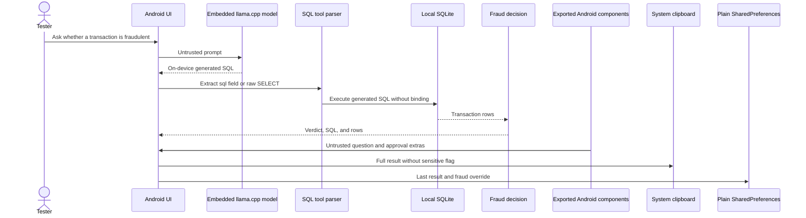

# Architecture and threat boundaries

The rendered diagrams are also embedded in the repository
[README](../README.md):

* [Data-flow diagram with trust boundaries](diagrams/data-flow.svg)
* [Mobile investigation sequence diagram](diagrams/sequence.svg)

This diagram is intentionally a threat map as well as an architecture sketch.
Every arrow is a place where the lab lets untrusted data cross a boundary:

* the tester controls the natural-language prompt;
* the parser accepts several permissive response formats;
* SQLite receives model-generated SQL directly; and
* the UI, clipboard, preferences, exported components.
